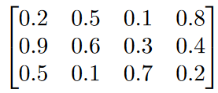
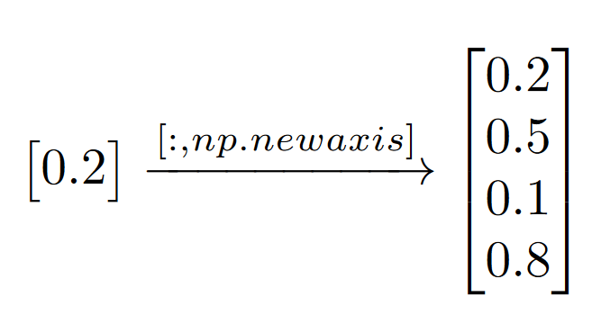
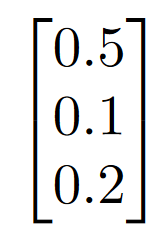
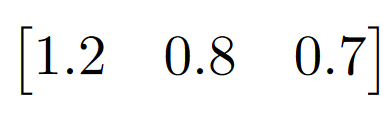
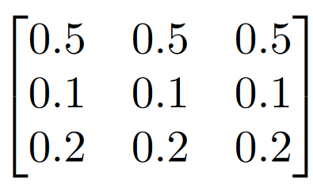
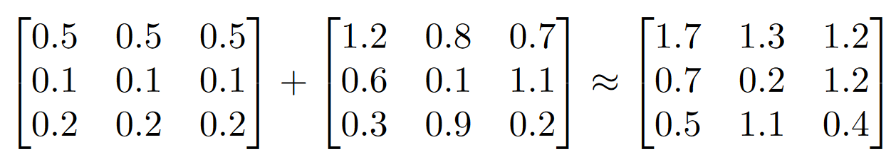

# Visual Transformers (ViTs)

## Introduction to Vision Transformers (ViTs)

Transformers have been widely used in NLP tasks, and have shown to be very effective. Some notable examples of transformers in NLP include:
- **ChatGPT**
- **Gemini**
- **Claude**
    
Despite their success and dominance in NLP, they have not been used in vision tasks until recently. Vision Transformers (ViTs) are a relatively newer class of models that use transformers for vision tasks. They have shown to be very effective in image classification tasks, and have been shown to **outperform CNNs** in some cases.

Typically, in vision tasks, attention mechanisms are used to capture the relationships between pixels in an image. This is done by using convolutional layers in CNNs. However, ViTs use transformers to capture these relationships, and have shown to be very effective in tasks such as image classification.

The main drawback of ViTs when compared to CNNs is that they require a lot of training data to perform well. This inherent flaw stems from the fact that transformers **do not** have the **"inductive biases"** native to CNNs.

What does this mean? CNNs are designed to capture spatial relationships between pixels. When a CNN looks at an image, it assumes that the pixels that are close to each other are more related than pixels that are far apart. This is a very strong inductive bias, and it allows CNNs to perform well on relatively small datasets.

Transformers do not have this inductive bias and therefore do not make any assumptions about the spatial relationships between pixels. What researchers have found, however, is that **"large scale training trumps inductive biases."** While the initial cost means that ViTs require a lot of data to perform well, after training, they are able to use what they learned and generalize it to new tasks with much less data.

## Why I Chose to Work on an Image Encoder/Tokenizer for ViTs

Recently, **Andrej Karpathy** released a video in his series diving into how to build transformers from scratch. His most recent video entitled **"Let's build the GPT Tokenizer"** served as my introduction into how advanced tokenization worked and was awe-inspiring to say the least. In the video, he broke down how we can build a GPT-level tokenizer that is capable of converting text into a sequence of tokens that can be used as input to a transformer model. While his video was mostly focused on NLP tasks, a question that came to mind was: **"How do we convert an image into a sequence of tokens?"** 

As someone who has worked with CNNs, the idea of using transformers for vision tasks is quite intriguing. I decided to take on the challenge of building an image encoder/tokenizer for ViTs as a way to learn more about transformers and how to think about them specifically in the context of vision tasks, but also to explore the idea of using transformers for multi-modal tasks in general.

I believe that this project has served as a great learning experience and has given me some deeper insights into transformers and how I can use them in my own projects. Admittedly, this project is more of an exploration rather than a definitive and efficient solution for encoding and tokenization, and should be taken as such. Resources are actually quite scarce for newcomers to the field, so I believe that this project will serve as a great starting point for anyone who is interested in learning about ViTs and transformers in general.

# Important Concepts

## How We Get Positional Encodings for Patches

### Sinusoidal Positional Encodings

The original transformer paper introduces positional encodings that use sine and cosine functions of different frequencies. For each dimension of the positional encoding, the encoding alternates between a sine and cosine function:

$PE_{(pos, 2i)} = \sin\left(\frac{pos}{10000^{2i/d_{\text{model}}}}\right)$

$PE_{(pos, 2i+1)} = \cos\left(\frac{pos}{10000^{2i/d_{\text{model}}}}\right)$

where:

*   $pos$ is the position of the patch in the sequence.
*   $i$ is the current dimension.
*   $d_{\text{model}}$ is the total number of dimensions in the positional encoding (in this context, it would be the dimensionality you project your patch vectors to).
*   This results in a unique positional encoding for each position and dimension.

### Why We Need Positional Encodings

As explained above, transformers do not have any inductive biases, and therefore do not make any assumptions about the spatial relationships. The data is processed in parallel, and the model does not have any information about the order of the data. This is why we need positional encodings. They are added to the patch embeddings to give the model information about the order of the patches. This is important because the model needs to know the order of the patches in order to capture the spatial relationships between them.

## Example of Using newaxis to Convert a Row Vector to a Column Vector

### Example Positional Encoding

### Making a Row Vector a Column Vector

## How Broadcasting Works Once We Have a Column Vector

### Example Positional Encoding (Column Vector)

### Example Row from Patch Embedding that We Want to Add to the Positional Encoding

### Preparing the Positional Encoding for Broadcasting

### Now We Can Add the Patch Embedding to the Positional Encoding

### Why This Matters
This is important because it allows us to add the positional encoding to the patch embeddings without having to worry about the dimensions of the positional encoding. This is because the positional encoding is broadcasted to the same shape as the patch embeddings, and then added to the patch embeddings. This is a very efficient way to add positional encodings to the patch embeddings, and is a key part of the ViT model.

# References
- [An Image is Worth 16x16 Words: Transformers for Image Recognition at Scale](https://arxiv.org/abs/2010.11929)
- [Vision Transformer (ViT) - An Image is Worth 16x16 Words](https://www.youtube.com/watch?v=TrdevFK_am4)
- [Let's build the GPT Tokenizer](https://youtu.be/zduSFxRajkE?si=qWtUIN_Q-2aRUzNG)
- [The Illustrated Transformer](https://jalammar.github.io/illustrated-transformer/)
