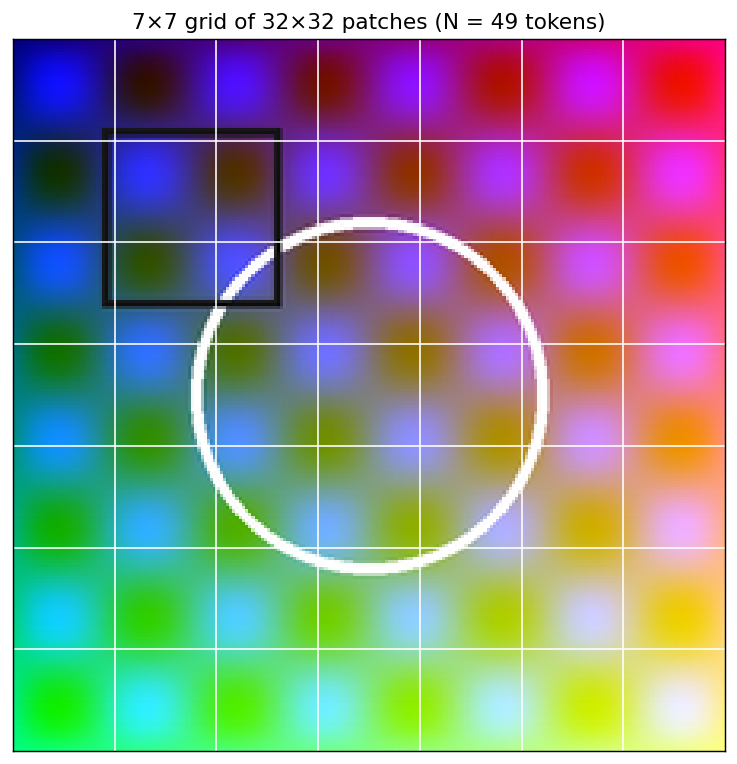
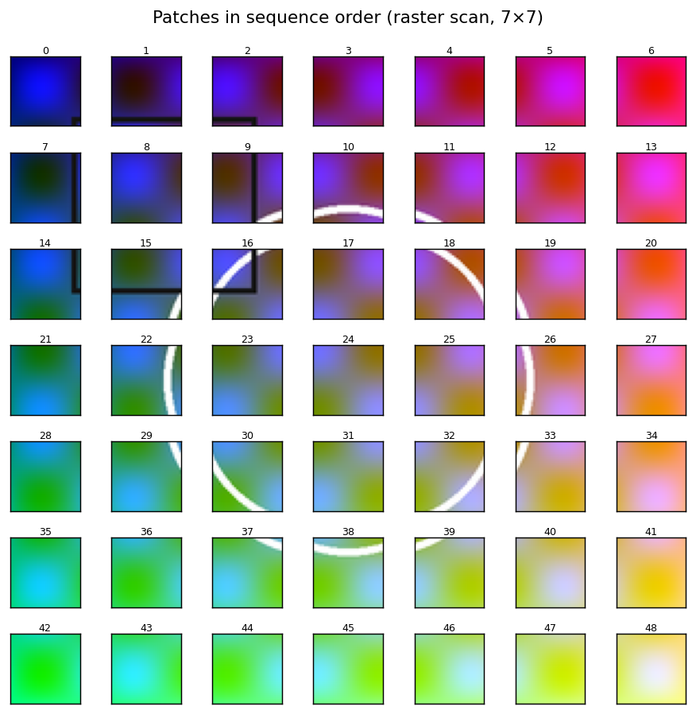
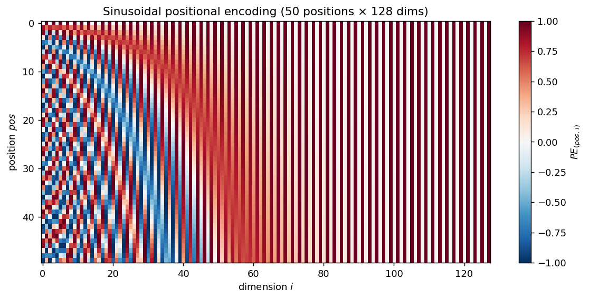
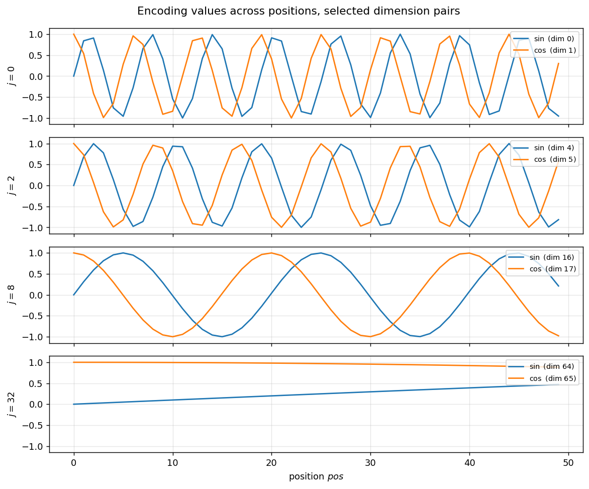
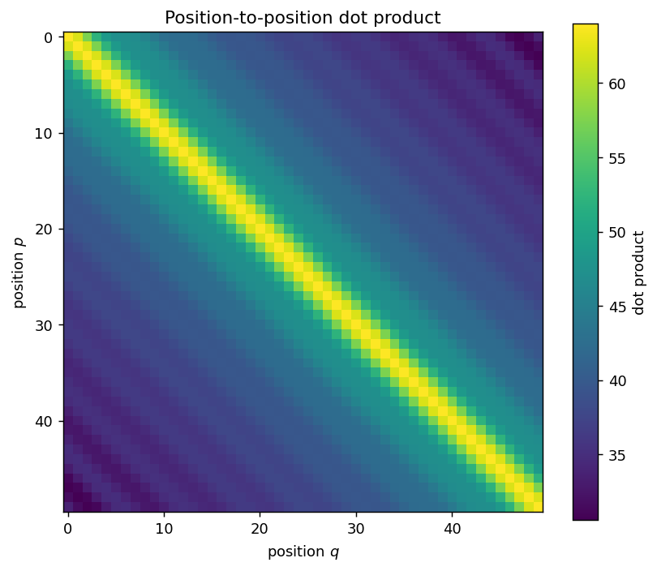
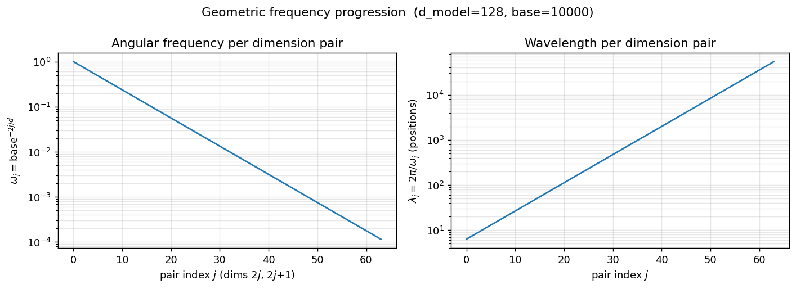

# ViT Image Tokenizer

A tested, documented, from-scratch implementation of the part of a Vision
Transformer that nobody explains properly: how an image becomes a sequence of
tokens.

```
images (B, C, H, W)
  └─ patchify ──────────► (B, N, C·P²)     N = (H/P)(W/P) flattened patches
      └─ linear projection ► (B, N, d)     z = Wx + b, learnable
          └─ prepend [CLS] ► (B, N+1, d)   learnable summary token
              └─ + positional encoding ► (B, N+1, d)   ready for the transformer
```

This began as a learning PoC inspired by Karpathy's *"Let's build the GPT
Tokenizer"* — the question being *"what is the image equivalent of a
tokenizer?"* It has since been rebuilt into a proper package: every design
choice is derived mathematically in [`docs/MATH.md`](docs/MATH.md), every
derived property is verified numerically by the test suite, and every stage
can be visualized. The original scripts are preserved in
[`legacy/`](legacy/) with a post-mortem of their bugs.

## Highlights

- **Correct, minimal, dependency-light.** `torch`, `numpy`, `pillow`,
  `matplotlib` — no torchvision required.
- **The math is written down and tested.** [`docs/MATH.md`](docs/MATH.md)
  derives the patch algebra, the projection ↔ strided-convolution equivalence,
  the geometric frequency spectrum, the exact norm $\|PE\|^2 = d/2$, the
  Toeplitz similarity structure, the rotation-matrix relative-position
  property, and the Xavier variance argument. Each claim cites the test that
  checks it; 75 tests pass.
- **Visualize everything.** Patch grids, exploded patch sequences,
  encoding heatmaps, position-similarity matrices, frequency spectra,
  per-dimension curves.
- **Four positional schemes**: sinusoidal 1-D (original Transformer),
  factorized sinusoidal 2-D (DETR/MAE-style), learnable (the actual ViT
  paper), or none (for ablations).

## Install

```bash
git clone https://github.com/seth-linares/ViT-Image-Tokenizer
cd ViT-Image-Tokenizer
pip install -e .          # add [dev] for pytest
```

## Quickstart

```python
import torch
from vit_tokenizer import ViTPatchEmbedding

tokenizer = ViTPatchEmbedding(
    image_size=224,
    patch_size=16,
    d_model=768,
    positional_encoding="sinusoidal-1d",   # or "sinusoidal-2d" | "learnable" | "none"
)

images = torch.randn(8, 3, 224, 224)
tokens = tokenizer(images)                 # (8, 197, 768) — 196 patches + [CLS]
```

`ViTPatchEmbedding` is an `nn.Module`: drop it in as the first layer of a ViT
and the projection matrix, bias, and class token train with the rest of the
model.

Loading real images from a `root/<class>/<image>` folder layout:

```python
from torch.utils.data import DataLoader
from vit_tokenizer import ImageFolderDataset, default_transform

dataset = ImageFolderDataset("path/to/data", transform=default_transform(image_size=224))
loader = DataLoader(dataset, batch_size=32, shuffle=True)

images, labels = next(iter(loader))
tokens = tokenizer(images)                 # (32, 197, 768)
```

`default_transform` resizes preserving aspect ratio, pads to square, converts
to a tensor, and normalizes with ImageNet statistics — all implemented in
this repo (see [`vit_tokenizer/dataset.py`](vit_tokenizer/dataset.py)).

The lower-level pieces are exposed directly if you want to build things up
yourself:

```python
from vit_tokenizer import patchify, unpatchify, sinusoidal_positional_encoding

patches = patchify(images, patch_size=16)        # (32, 196, 768)
assert torch.equal(unpatchify(patches, 16, 224), images)   # exact inverse

pe = sinusoidal_positional_encoding(197, 768)    # (197, 768)
```

## Visual tour

Generate the full gallery (and a shape walkthrough) with:

```bash
python examples/demo.py                        # synthetic image
python examples/demo.py --image yourphoto.jpg --patch-size 16
```

### The image becomes a sequence

The image is carved into an evenly divisible grid; each cell is flattened in
raster order into one row of the token matrix:





### The positional encoding table

Rows are positions, columns are dimensions. Low dimensions oscillate fast
(fine position), high dimensions slowly (coarse position) — a continuous
analogue of binary counting:





### Why this particular encoding?

The dot product between two position vectors depends only on their *offset*
(the matrix below is constant along diagonals), giving attention a built-in
notion of "nearby". And the frequencies form a geometric progression spanning
wavelengths from $2\pi$ to $\approx 2\pi \cdot 10^4$ positions:





The full story — including the proof that a position shift is a fixed
block-rotation linear map, the property RoPE later built on — is in
[`docs/MATH.md` § 5](docs/MATH.md#5-sinusoidal-positional-encodings).

## Running the tests

```bash
pip install -e ".[dev]"
pytest
```

The suite is organized as executable math: equivalence of the two `div_term`
formulations seen in the wild, entrywise agreement with the paper's formula,
exact patchify/unpatchify round-trips, the linear-projection ↔ `Conv2d`
identity, gradient flow to every learnable parameter, and the geometric
properties of the encodings (norms, Toeplitz Gram matrix, rotation property).

## Repository layout

```
vit_tokenizer/
  patching.py     patchify / unpatchify — pure reindexings, exactly invertible
  positional.py   sinusoidal encodings, 1-D and factorized 2-D
  embedding.py    ViTPatchEmbedding: projection + [CLS] + positions (nn.Module)
  dataset.py      ResizeAndPad, to_tensor, Normalize, ImageFolderDataset
  visualize.py    figure builders for every stage
tests/            75 tests; each MATH.md claim cites its test
docs/MATH.md      full derivations
docs/figures/     generated gallery (examples/demo.py)
examples/demo.py  end-to-end walkthrough + figure generation
legacy/           the original PoC scripts, with a bug post-mortem
```

## What changed from the PoC

The original scripts (preserved in [`legacy/`](legacy/)) had the right ideas
and several real bugs — including a patch-flattening reshape that mixed pixels
across patches, learnable parameters stored on a `Dataset` where no optimizer
could see them, and an `__getitem__` that crashed on tensor-shape mismatches.
Each issue is documented in [`legacy/README.md`](legacy/README.md) alongside
the fix and the regression test that now guards it.

## References

- [An Image is Worth 16x16 Words: Transformers for Image Recognition at Scale](https://arxiv.org/abs/2010.11929)
- [Attention Is All You Need](https://arxiv.org/abs/1706.03762)
- [Let's build the GPT Tokenizer — Karpathy](https://youtu.be/zduSFxRajkE)
- [Transformer Architecture: The Positional Encoding — Kazemnejad](https://kazemnejad.com/blog/transformer_architecture_positional_encoding/)
- [The Illustrated Transformer — Alammar](https://jalammar.github.io/illustrated-transformer/)
- Full bibliography in [`docs/MATH.md` § 9](docs/MATH.md#9-references)
